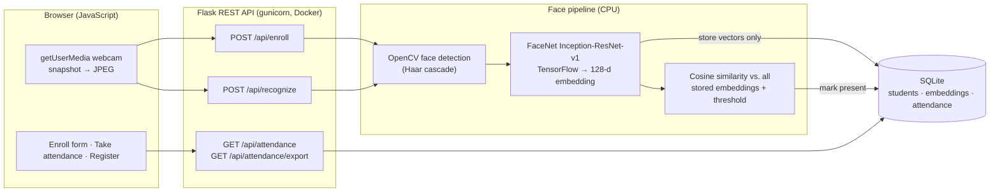

# Smart Attendance System

A face-recognition attendance web app. You enroll a face from the browser webcam, press **Take attendance**, and the system recognises you and records you as present. The register can be exported as CSV.

**Live demo:** https://huggingface.co/spaces/ishapatil202/smart-attendance <!-- update after deploying -->


## What it does

- **Enroll:** enter a name and capture 3 webcam snapshots (or upload a photo). Each detected face becomes a 128-dimensional FaceNet embedding.
- **Take attendance:** the browser captures one frame. The API detects every face in it, matches each against the stored embeddings and marks matches present (once per person per day).
- **Register and export:** the attendance table shows today or all records, with a one-click CSV download.

## Architecture



| Layer | Tech |
|---|---|
| Frontend | HTML, CSS, vanilla JavaScript (`getUserMedia`, canvas overlay, Fetch API) |
| Backend | Python 3.11, Flask 3, gunicorn |
| ML | OpenCV face detection, FaceNet (DeepFace Inception-ResNet-v1, TensorFlow 2.15), open-set cosine matching |
| Data | SQLite with 3 tables: `students`, `embeddings`, `attendance` |
| Deploy | Docker on Hugging Face Spaces (free CPU) |
| Quality | `unittest` API tests and a FaceNet smoke test, both run during the Docker build. Per-request latency logging and `/api/metrics` |

## API

| Method | Route | Body / query | Returns |
|---|---|---|---|
| `POST` | `/api/enroll` | `{ "name": "...", "photos": ["data:image/jpeg;base64,..."] }` (1 to 5 photos, or a single `"photo"`) | `201 { student_id, name, embeddings_stored }` |
| `POST` | `/api/recognize` | `{ "frame": "data:image/jpeg;base64,..." }` | `{ faces: [{ name, confidence, status, box }], latency_ms }` |
| `GET` | `/api/attendance` | `?date=YYYY-MM-DD` or `?date=today` (optional) | `{ records: [{ name, date, time, confidence }] }` |
| `GET` | `/api/attendance/export` | same as above | CSV file |
| `GET` | `/api/health` | | model status and counts |
| `GET` | `/api/metrics` | | recognition latency (mean, p50, p95) since the last restart |

`status` is `marked`, `already_marked` or `unknown`. Unknown faces are never written to the database.

## Design decisions

- **Open-set matching instead of an SVM.** The original desktop version trained a LinearSVC on the embeddings. A closed-set classifier always picks *someone*, which is wrong when most faces are strangers. The web edition compares against every stored embedding with a cosine-similarity threshold (default 0.60, from DeepFace's FaceNet cosine distance of 0.40). New people are recognisable immediately, with no retraining.
- **Several embeddings per person.** Enrollment stores one vector per snapshot. Matching takes the best over all of them, which handles small pose and lighting changes.
- **Snapshot, not streaming, recognition.** One frame per click keeps the app responsive on free CPU hardware.
- **Duplicate-face guard.** Enrolling a face that already matches someone is rejected.

## Privacy

- **No photos are stored.** Images are processed in memory and discarded. Only 128-number embeddings are saved, and a face cannot be reconstructed from one.
- **Visitor data auto-clears.** Anyone who enrolls on the demo is deleted, with their embeddings and attendance, after 24 hours (`SMART_ATTENDANCE_RETENTION_HOURS`).
- The bundled sample person is a public-domain NASA portrait (see `samples/README.md`).

## Run it yourself

```bash
docker build -t smart-attendance .
docker run -p 7860:7860 smart-attendance
# open http://localhost:7860
```

The build downloads the FaceNet weights, verifies their SHA-256, then runs the ML smoke test and the API tests. A broken model fails the build instead of the live site.

Tests only (no TensorFlow needed):

```bash
python3 -m venv .venv && source .venv/bin/activate
pip install -r requirements-test.txt
python -m unittest discover -s tests -v
```

## Measuring accuracy

`scripts/evaluate.py` runs the exact production pipeline on a labeled dataset and prints identification accuracy, the false-accept rate on strangers, and per-frame latency:

```bash
docker run --rm smart-attendance python scripts/evaluate.py --lfw   # Labeled Faces in the Wild
```

## Configuration

| Variable | Default | Purpose |
|---|---|---|
| `SMART_ATTENDANCE_MATCH_THRESHOLD` | `0.60` | cosine similarity needed to accept a match |
| `SMART_ATTENDANCE_RETENTION_HOURS` | `24` | when visitor enrollments are deleted |
| `SMART_ATTENDANCE_DB_PATH` | `data/attendance.db` | SQLite file |
| `SMART_ATTENDANCE_SAMPLES_DIR` | `samples/` | photos enrolled as sample people at startup |

## Project layout

```
webapp/            Flask app: app.py (routes), face_engine.py, db.py, samples.py, static/ (UI)
tests/             API route tests
scripts/           evaluate.py (accuracy + latency)
samples/           public-domain sample person
face_preprocessing.py, model_loader.py   FaceNet preprocessing and loading (shared with the desktop version)
attendance.py ...  original Tkinter desktop version (needs a local camera and MySQL)
```

## Original desktop version

This started as a Tkinter desktop app with OpenCV camera capture, MySQL, an SVM classifier and scheduled absence emails. Those files are still in the repo. The web edition reuses its FaceNet model, preprocessing and face detector, and replaces the desktop UI, MySQL and SVM so it can run in a browser on free hosting.
