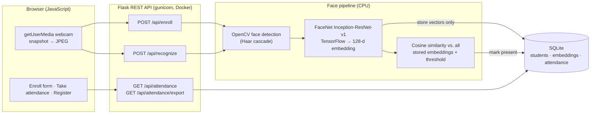

# Smart Attendance System

Face-recognition attendance in the browser: enroll your face from the webcam, press **Take attendance**, and the app recognises you and marks you present.

**Live demo:** https://huggingface.co/spaces/ishapatil202/smart-attendance
*(free hosting: if it's been idle, the first load takes about a minute to wake up)*

<!-- Add after deploying:  -->

**Stack:** Python · Flask · TensorFlow (FaceNet) · OpenCV · SQLite · JavaScript · Docker · Hugging Face Spaces

## Highlights

- **Full pipeline:** browser webcam → Flask REST API → OpenCV face detection → FaceNet 128-d embeddings → cosine-similarity matching → SQLite.
- **Open-set recognition:** strangers are reported as "unknown" instead of being forced onto the closest enrolled person, and new people work instantly with no retraining.
- **Privacy by design:** photos are never stored, only embeddings, and visitor data is deleted automatically after 24 hours.
- **Tested before it ships:** API tests and a FaceNet smoke test run inside the Docker build, so a broken model never reaches the live site.

## How it works



## Design decisions

- **Open-set matching instead of an SVM.** The original desktop version trained a LinearSVC on the embeddings. A closed-set classifier always picks *someone*, which is wrong when most faces are strangers. The web edition compares against every stored embedding with a cosine-similarity threshold (default 0.60, from DeepFace's FaceNet cosine distance of 0.40). New people are recognisable immediately, with no retraining.
- **Several embeddings per person.** Enrollment stores one vector per snapshot. Matching takes the best over all of them, which handles small pose and lighting changes.
- **Snapshot, not streaming, recognition.** One frame per click keeps the app responsive on free CPU hardware.
- **Duplicate-face guard.** Enrolling a face that already matches someone is rejected.

## Privacy

- **No photos are stored.** Images are processed in memory and discarded. Only 128-number embeddings are saved, never the images themselves.
- **Visitor data auto-clears.** Anyone who enrolls on the demo is deleted, with their embeddings and attendance, after 24 hours (`SMART_ATTENDANCE_RETENTION_HOURS`).
- The bundled sample person is a public-domain NASA portrait (see `samples/README.md`).

## Run it locally

```bash
docker build -t smart-attendance .
docker run -p 7860:7860 smart-attendance      # open http://localhost:7860
```

Tests only (no TensorFlow needed):

```bash
python3 -m venv .venv && source .venv/bin/activate
pip install -r requirements-test.txt
python -m unittest discover -s tests -v
```

Accuracy and latency on Labeled Faces in the Wild, using the exact production pipeline:

```bash
docker run --rm smart-attendance python scripts/evaluate.py --lfw
```

<details>
<summary><b>API reference</b></summary>

| Method | Route | Body / query | Returns |
|---|---|---|---|
| `POST` | `/api/enroll` | `{ "name": "...", "photos": ["data:image/jpeg;base64,..."] }` (1 to 5 photos, or a single `"photo"`) | `201 { student_id, name, embeddings_stored }` |
| `POST` | `/api/recognize` | `{ "frame": "data:image/jpeg;base64,..." }` | `{ faces: [{ name, confidence, status, box }], latency_ms }` |
| `GET` | `/api/attendance` | `?date=YYYY-MM-DD` or `?date=today` (optional) | `{ records: [{ name, date, time, confidence }] }` |
| `GET` | `/api/attendance/export` | same as above | CSV file |
| `GET` | `/api/health` | | model status and counts |
| `GET` | `/api/metrics` | | recognition latency (mean, p50, p95) since the last restart |

`status` is `marked`, `already_marked` or `unknown`. Unknown faces are never written to the database.

</details>

<details>
<summary><b>Configuration and project layout</b></summary>

| Variable | Default | Purpose |
|---|---|---|
| `SMART_ATTENDANCE_MATCH_THRESHOLD` | `0.60` | cosine similarity needed to accept a match |
| `SMART_ATTENDANCE_RETENTION_HOURS` | `24` | when visitor enrollments are deleted |
| `SMART_ATTENDANCE_DB_PATH` | `data/attendance.db` | SQLite file |
| `SMART_ATTENDANCE_SAMPLES_DIR` | `samples/` | photos enrolled as sample people at startup |

```
webapp/            Flask app: app.py (routes), face_engine.py, db.py, samples.py, static/ (UI)
tests/             API route tests
scripts/           evaluate.py (accuracy + latency)
samples/           public-domain sample person
face_preprocessing.py, model_loader.py   FaceNet preprocessing and loading (shared with the desktop version)
attendance.py ...  original Tkinter desktop version (needs a local camera and MySQL)
```

</details>

<details>
<summary><b>Original desktop version</b></summary>

This started as a Tkinter desktop app with OpenCV camera capture, MySQL, an SVM classifier and scheduled absence emails. Those files are still in the repo. The web edition reuses its FaceNet model, preprocessing and face detector, and replaces the desktop UI, MySQL and SVM so it runs in a browser on free hosting.

</details>
